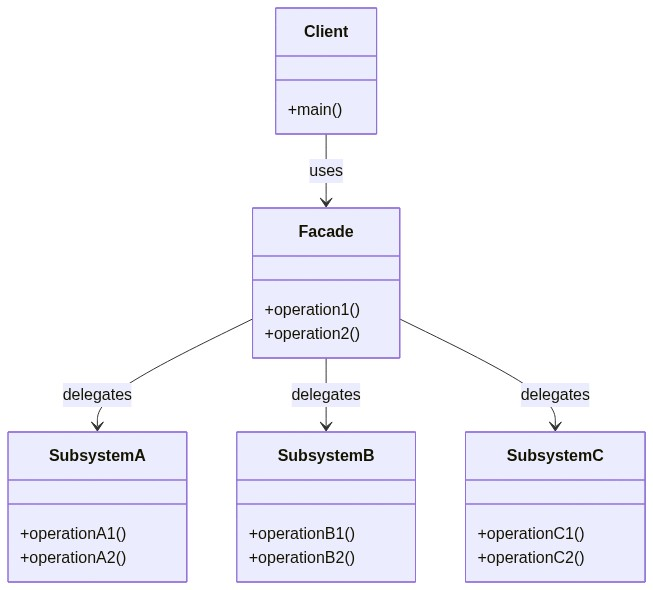
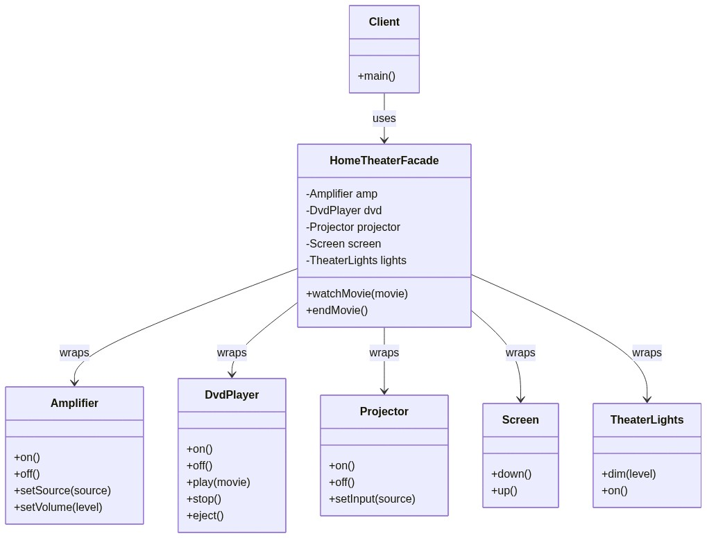

# Facade Design Pattern
## Simplifying Complex Subsystems in OOP

CS202 — Object-Oriented Programming Seminar

**Presenter**: CS202 Seminar Group
**Date**: July 2026

---

# Real-World Scenario: Home Theater

Imagine coordinating multiple home theater components:
- **Amplifier**: Powers sound, sets input source & volume.
- **DVD Player**: Holds and plays physical media.
- **Projector**: Handles video rendering and input selection.
- **Screen**: Physical screen that must be lowered.
- **Theater Lights**: Ambient atmosphere control.

To watch a movie, you must perform at least **6 actions in specific sequence**.
To end the movie, you must perform **6 cleanup actions in reverse**.

---

<!-- _style: "code { font-size: 14px; } pre { margin-bottom: 30px !important; }" -->
# Naive Implementation (Without Pattern)

Direct client-subsystem interaction requires the client to orchestrate everything manually:

```cpp
int main() {
    Amplifier amp; DvdPlayer dvd; Projector projector;
    Screen screen; TheaterLights lights;

    lights.dim(20);
    screen.down();
    projector.on();
    projector.setInput("DVD");
    dvd.on();
    amp.on();
    amp.setSource("DVD");
    amp.setVolume(10);
    dvd.play("The Matrix");

    // ... movie plays ...
}
```

---

# Problems with the Naive Approach

1. **Tight Coupling**: The client knows every subsystem class and its API. Replacing or updating any subsystem component breaks the client.
2. **Complex Orchestration**: The client must execute a multi-step procedure.
3. **Code Duplication**: Every client wanting to watch a movie must repeat the same boilerplate code.
4. **SRP Violation**: The client handles core business logic *and* the details of coordinating hardware.
5. **High Maintenance**: Adding a new component (e.g. Subwoofer) requires updating every client location.

---

# The Facade Design Pattern

> "Provide a unified interface to a set of interfaces in a subsystem. Facade defines a higher-level interface that makes the subsystem easier to use." 
> — *Gang of Four (GoF)*

- **Category**: Structural Design Pattern.
- **Goal**: Shield clients from subsystem complexity without hiding the subsystems completely.
- **Direct Access**: Clients can still bypass the Facade and use subsystem classes directly if they need fine-grained control.

---

# General Class Diagram

The Client interacts with the Facade. The Facade delegates to Subsystem A, B, and C.



---

# Home Theater Class Diagram



---

<!-- _style: "code { font-size: 12px; } pre { margin-bottom: 30px !important; }" -->
# C++ Implementation: The Facade

```cpp
// HomeTheaterFacade.h
class HomeTheaterFacade {
private:
    Amplifier& amp; DvdPlayer& dvd; Projector& projector;
    Screen& screen; TheaterLights& lights;
public:
    HomeTheaterFacade(Amplifier& a, DvdPlayer& d, Projector& p,
                      Screen& s, TheaterLights& l)
        : amp(a), dvd(d), projector(p), screen(s), lights(l) {}

    void watchMovie(const std::string& movie) {
        lights.dim(20); screen.down(); projector.on();
        projector.setInput("DVD"); dvd.on(); amp.on();
        amp.setSource("DVD"); amp.setVolume(10); dvd.play(movie);
    }
    void endMovie() {
        dvd.stop(); amp.off(); dvd.off();
        projector.off(); screen.up(); lights.on();
    }
};
```

---

<!-- _style: "code { font-size: 14px; } pre { margin-bottom: 30px !important; }" -->
# C++ Implementation: Clean Client Code

The client interacts solely with the simplified Facade interface:

```cpp
// main.cpp
int main() {
    Amplifier amp;
    DvdPlayer dvd;
    Projector projector;
    Screen screen;
    TheaterLights lights;

    HomeTheaterFacade facade(amp, dvd, projector, screen, lights);

    // Only 2 direct orchestrating calls instead of 15!
    facade.watchMovie("The Matrix");
    std::cout << "\n--- Movie is playing ---\n\n";
    facade.endMovie();

    return 0;
}
```

---

<!-- _style: "table { font-size: 20px; }" -->
# Pros and Cons of the Facade Pattern

| Pros | Cons |
| :--- | :--- |
| **Loose Coupling**: Client is isolated from complex subsystem updates. | **God Object Risk**: The facade can grow too large and acquire too many responsibilities. |
| **Reduces Duplication**: Complex execution flows are defined only once. | **Indirection Layer**: Adds a small layout/call routing indirection overhead. |
| **Direct Access Intact**: Clients can still bypass the Facade for fine control. | **Hidden Functionality**: Can obscure advanced parameters from basic clients. |

---

# Real-World Applications of Facade

- **Web Development (API Gateway)**:
  Aggregates multiple microservices (Auth, Inventory, Orders) into a single gateway entry point.
- **Mobile Development (Hardware Abstractions)**:
  `Camera.takePhoto()` wraps device buffers, color profiles, hardware drivers, and file output.
- **Game Development (Game Engines)**:
  `Rigidbody.AddForce()` wraps sophisticated linear algebra, physics solver engines, and hardware acceleration.
- **Database Access (JDBC / ORMs)**:
  `session.save(user)` handles connections, connection pools, and database-specific dialect generation.

---

# Quiz — Question 1

**What type of design pattern is the Facade pattern?**

<div class="kahoot-grid">
  <div class="card">a) Creational</div>
  <div class="card correct">b) Structural</div>
  <div class="card">c) Behavioral</div>
  <div class="card">d) Concurrency</div>
</div>

---

# Quiz — Question 2

**What is the primary purpose of the Facade pattern?**

<div class="kahoot-grid">
  <div class="card">a) Create objects without concrete classes</div>
  <div class="card correct">b) Provide simplified subsystem interface</div>
  <div class="card">c) Define a one-to-many dependency</div>
  <div class="card">d) Compose objects into tree structures</div>
</div>

---

# Quiz — Question 3

**In the home theater example, what is the benefit of the Facade?**

<div class="kahoot-grid">
  <div class="card">a) DVD player no longer needs to be powered on</div>
  <div class="card correct">b) Client no longer interacts with subsystems directly</div>
  <div class="card">c) Amplifier automatically adjusts volume</div>
  <div class="card">d) Screen no longer needs to be lowered</div>
</div>

---

# Quiz — Question 4

**Which of the following is a disadvantage of the Facade pattern?**

<div class="kahoot-grid">
  <div class="card">a) Increases coupling with subsystems</div>
  <div class="card correct">b) Can become a god object (too many responsibilities)</div>
  <div class="card">c) Prevents client from direct subsystem access</div>
  <div class="card">d) Requires all subsystem classes to be rewritten</div>
</div>

---

# Quiz — Question 5

**Which of these is NOT a real-world use of the Facade pattern?**

<div class="kahoot-grid">
  <div class="card">a) API Gateway in microservices</div>
  <div class="card correct">b) Singleton logging utility</div>
  <div class="card">c) ORM frameworks like Hibernate</div>
  <div class="card">d) Game engine high-level APIs</div>
</div>

---

# Quiz — Question 6

**Does the Facade pattern prevent clients from accessing subsystems directly?**

<div class="kahoot-grid">
  <div class="card">a) Yes, clients must always use the facade</div>
  <div class="card correct">b) No, clients can still use subsystems if needed</div>
  <div class="card">c) Only if the facade is declared final</div>
  <div class="card">d) Only for private subsystem methods</div>
</div>

---

# Quiz — Question 7

**What happens if a new component (e.g. subwoofer) is added?**

<div class="kahoot-grid">
  <div class="card">a) Every client must be updated</div>
  <div class="card correct">b) Only the facade needs updating; clients are unchanged</div>
  <div class="card">c) The facade pattern cannot handle new components</div>
  <div class="card">d) The subwoofer must implement its own facade</div>
</div>

---

<!-- _style: "section { font-size: 24px; }" -->
# Reviewer Roles & Feedback Loop

The Facade design pattern seminar features peer reviewers responsible for:
- **Listening & Clarifying**: Ensuring code readability and design clarity.
- **Challenging Decisions**: Questioning facade encapsulation limits and coupling levels.
- **Reviewer Focus Areas**:
  - Is the real-world problem appropriately complex?
  - Does the naive solution show genuine pain points?
  - Are the class diagrams accurate and compliant?
  - Are pros/cons/trade-offs presented objectively?

---

<!-- _style: "section { font-size: 21px; }" -->
# Conclusion & References

- Gamma, E., Helm, R., Johnson, R., & Vlissides, J. (1994). *Design Patterns: Elements of Reusable Object-Oriented Software*. Addison-Wesley.
- Freeman, E., & Robson, E. (2004). *Head First Design Patterns*. O'Reilly Media.
- Refactoring Guru. (n.d.). *Facade Design Pattern*. https://refactoring.guru/design-patterns/facade
- SourceMaking. (n.d.). *Facade Design Pattern*. https://sourcemaking.com/design_patterns/facade

---

# Questions & Answers

**Thank you!**
