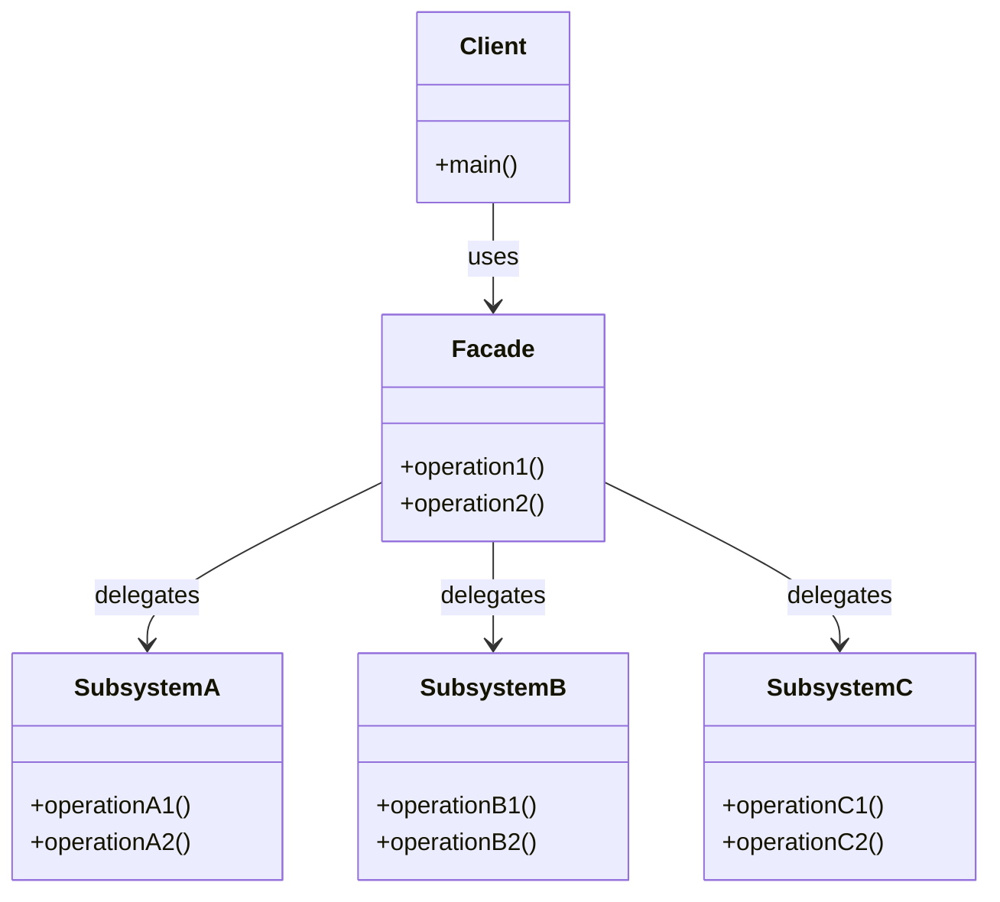
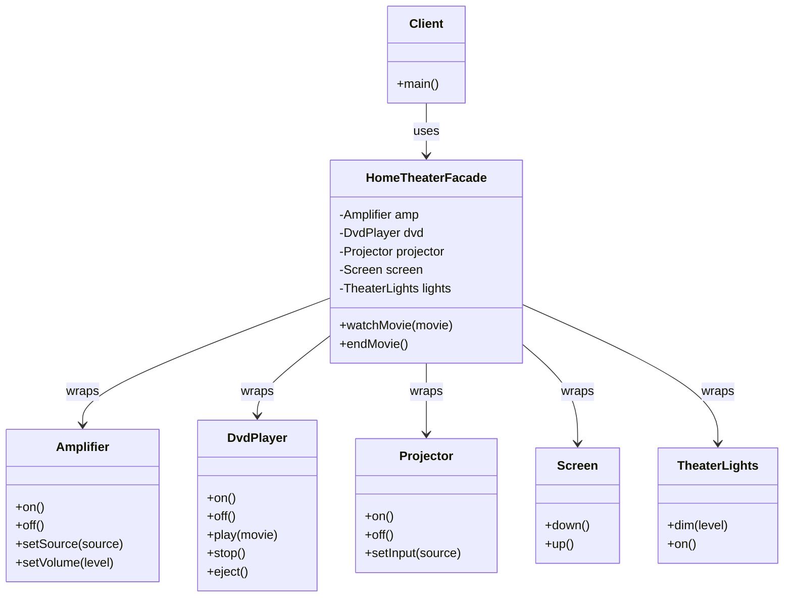

# Report: Facade Design Pattern

## 1. Real-World Problem: Home Theater System

Imagine you just bought a home theater system. Watching a movie involves coordinating multiple components:

- **Amplifier** — powers the sound, must be turned on and configured
- **DVD Player** — holds the disc and plays the movie
- **Projector** — displays the video onto a screen
- **Screen** — must be lowered before the movie starts
- **Theater Lights** — must be dimmed for the proper atmosphere

To watch a movie, you need to perform these steps in the correct order:

1. Dim the lights to 20%.
2. Lower the projection screen.
3. Turn on the projector and set its input to the DVD player.
4. Turn on the DVD player.
5. Turn on the amplifier, set its source to DVD, and adjust the volume.
6. Play the movie.

When the movie ends, you must reverse each step: stop the DVD, turn off the amplifier, turn off the DVD player, turn off the projector, raise the screen, and turn the lights back on.

If any step is forgotten or done in the wrong order, the experience breaks down. This coordination problem is what the Facade pattern solves.

## 2. Naive Solution (Without the Pattern)

In a naive solution, the client code directly interacts with every subsystem. Here is the C++ implementation:

```cpp
// Amplifier.h
class Amplifier {
public:
    void on() { std::cout << "Amplifier: on\n"; }
    void off() { std::cout << "Amplifier: off\n"; }
    void setSource(const std::string& source) {
        std::cout << "Amplifier: source set to " << source << "\n";
    }
    void setVolume(int level) {
        std::cout << "Amplifier: volume set to " << level << "\n";
    }
};

// DvdPlayer.h
class DvdPlayer {
public:
    void on() { std::cout << "DVD Player: on\n"; }
    void off() { std::cout << "DVD Player: off\n"; }
    void play(const std::string& movie) {
        std::cout << "DVD Player: playing \"" << movie << "\"\n";
    }
    void stop() { std::cout << "DVD Player: stopped\n"; }
    void eject() { std::cout << "DVD Player: ejected\n"; }
};

// Projector.h
class Projector {
public:
    void on() { std::cout << "Projector: on\n"; }
    void off() { std::cout << "Projector: off\n"; }
    void setInput(const std::string& source) {
        std::cout << "Projector: input set to " << source << "\n";
    }
};

// Screen.h
class Screen {
public:
    void down() { std::cout << "Screen: lowered\n"; }
    void up() { std::cout << "Screen: raised\n"; }
};

// TheaterLights.h
class TheaterLights {
public:
    void dim(int level) {
        std::cout << "Theater Lights: dimmed to " << level << "%\n";
    }
    void on() { std::cout << "Theater Lights: on\n"; }
};

// main.cpp
int main() {
    Amplifier amp;
    DvdPlayer dvd;
    Projector projector;
    Screen screen;
    TheaterLights lights;

    // Watch movie
    lights.dim(20);
    screen.down();
    projector.on();
    projector.setInput("DVD");
    dvd.on();
    amp.on();
    amp.setSource("DVD");
    amp.setVolume(10);
    dvd.play("The Matrix");

    // ... movie plays ...

    // End movie
    dvd.stop();
    amp.off();
    dvd.off();
    projector.off();
    screen.up();
    lights.on();

    return 0;
}
```

## 3. Problems with the Naive Solution

1. **Tight coupling** — The client knows every subsystem class and its API. Changing any component (e.g., replacing the projector) requires updating the client.

2. **Complex orchestration** — The client must execute a multi-step procedure with a specific order. If repeated, the code is duplicated everywhere.

3. **Low reusability** — If another part of the application also needs to watch a movie, it must duplicate the entire sequence.

4. **Violation of the Single Responsibility Principle** — The client now handles business logic _and_ subsystem coordination.

5. **Maintenance burden** — Adding a new component (e.g., a subwoofer) means modifying every place that starts a movie.

## 4. Introduction to the Facade Pattern

**Facade** is a structural design pattern defined by the Gang of Four (GoF) that provides a simplified, unified interface to a set of interfaces in a subsystem. It defines a higher-level interface that makes the subsystem easier to use.

**Intent**: Provide a unified interface to a set of interfaces in a subsystem. Facade defines a higher-level interface that makes the subsystem easier to use.

**When to use**:
- You need to provide a simple interface to a complex subsystem.
- There are many dependencies between clients and implementation classes.
- You want to layer your subsystems — use a facade as the entry point to each layer.

## 5. General Class Diagram



The **Client** calls only the `Facade`. The **Facade** delegates the real work to the appropriate **Subsystem** classes. The client never interacts with subsystems directly.

## 6. Class Diagram for the Home Theater Problem



## 7. Implementation with the Facade Pattern

**HomeTheaterFacade** encapsulates the entire "watch movie" workflow:

```cpp
// HomeTheaterFacade.h
class HomeTheaterFacade {
private:
    Amplifier& amp;
    DvdPlayer& dvd;
    Projector& projector;
    Screen& screen;
    TheaterLights& lights;

public:
    HomeTheaterFacade(Amplifier& a, DvdPlayer& d, Projector& p,
                      Screen& s, TheaterLights& l)
        : amp(a), dvd(d), projector(p), screen(s), lights(l) {}

    void watchMovie(const std::string& movie) {
        lights.dim(20);
        screen.down();
        projector.on();
        projector.setInput("DVD");
        dvd.on();
        amp.on();
        amp.setSource("DVD");
        amp.setVolume(10);
        dvd.play(movie);
    }

    void endMovie() {
        dvd.stop();
        amp.off();
        dvd.off();
        projector.off();
        screen.up();
        lights.on();
    }
};
```

**Client code becomes dramatically simpler:**

```cpp
// main.cpp
int main() {
    Amplifier amp;
    DvdPlayer dvd;
    Projector projector;
    Screen screen;
    TheaterLights lights;

    HomeTheaterFacade facade(amp, dvd, projector, screen, lights);

    facade.watchMovie("The Matrix");
    // ... movie plays ...
    facade.endMovie();

    return 0;
}
```

## 8. Pros and Cons of the Facade Pattern

### Pros
- **Isolates clients from complex subsystems** — clients use a simple interface.
- **Promotes loose coupling** — changes in the subsystem do not affect the client.
- **Reduces code duplication** — complex sequences are defined once in the facade.
- **Improves readability** — intent is clear (`watchMovie()`, `endMovie()`).
- **Does not restrict access** — the client can still use subsystem classes directly if needed.

### Cons
- **The facade can become a god object** — if it grows too large, it accumulates too many responsibilities.
- **Adds an extra layer** — minimal overhead of one more indirection layer.
- **May hide important functionality** — power users who need fine-grained control must bypass the facade.

## 9. Other Real-World Applications

### Web Development (API Gateway)
In microservices architectures, an **API Gateway** acts as a facade between clients and multiple backend services. Instead of a mobile app making calls to 10 different services (auth, catalog, orders, payments, notifications), it calls a single API Gateway that routes and aggregates responses.

### Mobile Development (Hardware Abstraction)
Mobile frameworks provide facades over hardware subsystems — camera, GPS, sensors, and storage. Developers call high-level APIs like `Camera.takePhoto()` instead of managing raw sensor data, buffer allocation, and file I/O.

### Game Development (Game Engine)
Game engines like Unity or Unreal provide a facade over rendering, physics, audio, and input subsystems. The developer calls `PlaySound("effect.wav")` or `Rigidbody.AddForce(Vector3.up)` without needing to understand DirectX, audio pipelines, or physics solvers.

### Database Access (JDBC / ORM)
Libraries like JDBC or Hibernate are facades over complex database communication protocols. Developers write `session.save(user)` instead of constructing SQL packets, managing socket connections, and parsing result sets.

## 10. Quiz

1. **What type of design pattern is the Facade pattern?**
   - a) Creational
   - b) Structural
   - c) Behavioral
   - d) Concurrency

2. **What is the primary purpose of the Facade pattern?**
   - a) To create objects without specifying their concrete classes
   - b) To provide a simplified interface to a complex subsystem
   - c) To define a one-to-many dependency between objects
   - d) To compose objects into tree structures

3. **In the home theater example, what is the benefit of using a Facade?**
   - a) The DVD player no longer needs to be turned on
   - b) The client no longer needs to interact with each subsystem directly
   - c) The amplifier automatically sets the volume
   - d) The projection screen no longer needs to be lowered

4. **Which of the following is a disadvantage of the Facade pattern?**
   - a) It increases coupling between client and subsystem
   - b) It can become a god object with too many responsibilities
   - c) It prevents the client from accessing subsystem classes at all
   - d) It requires all subsystem classes to be rewritten

5. **Which of these is NOT a real-world use of the Facade pattern?**
   - a) API Gateway in microservices
   - b) Singleton logging utility
   - c) ORM frameworks like Hibernate
   - d) Game engine high-level APIs

6. **Does the Facade pattern prevent clients from accessing subsystem classes directly?**
   - a) Yes, clients must always go through the facade
   - b) No, clients can still use subsystem classes if needed
   - c) Only if the facade is declared as final
   - d) Only for private subsystem methods

7. **What happens if a new component is added to the subsystem (e.g., a subwoofer)?**
   - a) Every client must be updated
   - b) Only the facade needs updating; clients remain unchanged
   - c) The facade pattern cannot handle new components
   - d) The subwoofer must implement its own facade

### Answer Key
`1. b  2. b  3. b  4. b  5. b  6. b  7. b`

## 11. Group Presentation Notes

Each group presenting the Facade design pattern will be reviewed by 2–3 other groups. Reviewers are responsible for:

- Listening carefully to the presentation.
- Asking questions for clarification.
- Challenging assumptions or design decisions.
- Facilitating discussion and deeper understanding of the pattern.

Reviewers should focus on: whether the real-world problem is appropriately complex, whether the naive solution genuinely illustrates the pain points, whether the class diagrams are accurate, and whether the trade-offs of Facade are fairly presented.

### References

- Gamma, E., Helm, R., Johnson, R., & Vlissides, J. (1994). *Design Patterns: Elements of Reusable Object-Oriented Software*. Addison-Wesley.
- Freeman, E., & Robson, E. (2004). *Head First Design Patterns*. O'Reilly Media.
- Refactoring Guru. (n.d.). *Facade Design Pattern*. https://refactoring.guru/design-patterns/facade
- SourceMaking. (n.d.). *Facade Design Pattern*. https://sourcemaking.com/design_patterns/facade
