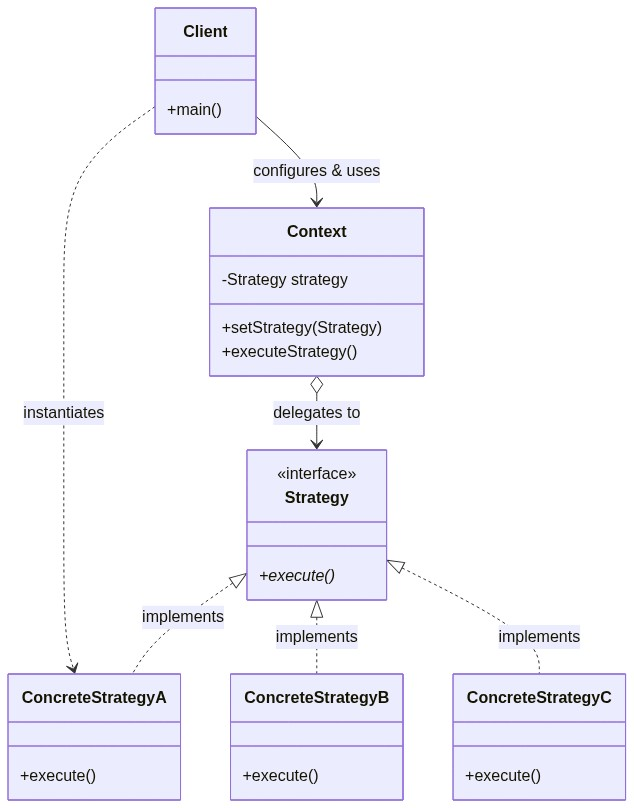
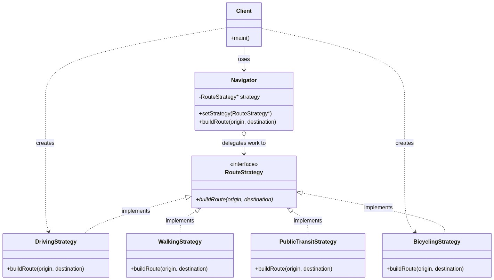

# Strategy Design Pattern
## Encapsulating Interchangeable Algorithms in OOP

CS202 — Object-Oriented Programming Seminar

**Presenter**: CS202 Seminar Group
**Date**: July 2026

---

# Real-World Scenario: Navigation App

Imagine building a GPS Navigation App (Google Maps):
- **Driving**: Prioritizes highways, live traffic bypass & toll roads.
- **Walking**: Prioritizes sidewalks, crosswalks & pedestrian short-cuts.
- **Public Transit**: Syncs bus schedules, metro lines & transfer routes.
- **Bicycling**: Prioritizes dedicated bike paths & flat terrain.

**Core Challenge**: How can we support dynamic algorithm switching without cluttering client code with conditional `if-else` blocks?

---

<!-- _style: "code { font-size: 14px; } pre { margin-bottom: 30px !important; }" -->
# Naive Implementation (Without Pattern)

Direct monolithic logic with `enum` and `if-else` blocks:

```cpp
int main() {
    Navigator navigator(TransportMode::DRIVING);
    navigator.buildRoute("Home", "Downtown Office");

    // Must switch mode via enum and run monolithic code block
    navigator.setMode(TransportMode::WALKING);
    navigator.buildRoute("Downtown Office", "City Park");

    navigator.setMode(TransportMode::PUBLIC_TRANSIT);
    navigator.buildRoute("City Park", "Home");

    return 0;
}
```

---

# Problems with the Naive Approach

1. **Violates Open/Closed Principle (OCP)**: Adding a new transport mode (e.g. `BICYCLING`) forces editing and recompiling `Navigator.h`.
2. **Violates Single Responsibility Principle (SRP)**: `Navigator` manages context *and* every single routing algorithm.
3. **Monolithic Code Bloat**: Hundreds of lines of unrelated algorithm math inside one class.
4. **Testing Nightmare**: Cannot unit-test individual algorithms independently.

---

# The Strategy Design Pattern

> "Define a family of algorithms, encapsulate each one, and make them interchangeable. Strategy lets the algorithm vary independently from clients that use it." 
> — *Gang of Four (GoF)*

- **Category**: Behavioral Design Pattern.
- **Goal**: Isolate algorithms into dedicated strategy classes implementing a common interface.
- **Composition over Inheritance**: Context delegates algorithm execution to a strategy object reference.

---

# General Class Diagram

The Client configures the Context with a Strategy object. The Context delegates work to the Strategy interface.



---

# Navigation App Class Diagram



---

<!-- _style: "code { font-size: 13px; } pre { margin-bottom: 30px !important; }" -->
# C++ Implementation: Strategy Classes

```cpp
// RouteStrategy.h (Interface)
class RouteStrategy {
public:
    virtual ~RouteStrategy() = default;
    virtual void buildRoute(const std::string& origin, const std::string& destination) const = 0;
};

// DrivingStrategy.h (Concrete Strategy)
class DrivingStrategy : public RouteStrategy {
public:
    void buildRoute(const std::string& origin, const std::string& destination) const override {
        std::cout << " -> Mode: DRIVING (Highway priority & live traffic bypass)\n";
    }
};

// BicyclingStrategy.h (Extension without modifying existing code!)
class BicyclingStrategy : public RouteStrategy {
public:
    void buildRoute(const std::string& origin, const std::string& destination) const override {
        std::cout << " -> Mode: BICYCLING (Bike lanes & flat elevation profile)\n";
    }
};
```

---

<!-- _style: "code { font-size: 14px; } pre { margin-bottom: 30px !important; }" -->
# C++ Implementation: Context & Clean Client

```cpp
// main.cpp
int main() {
    DrivingStrategy driving;
    WalkingStrategy walking;
    BicyclingStrategy bicycling;

    Navigator navigator(&driving); // Context
    navigator.buildRoute("Home", "Office");

    // Dynamic runtime strategy swap
    navigator.setStrategy(&walking);
    navigator.buildRoute("Office", "Park");

    // Seamless OCP extension
    navigator.setStrategy(&bicycling);
    navigator.buildRoute("Home", "River Trail");
    return 0;
}
```

---

<!-- _style: "table { font-size: 20px; }" -->
# Pros and Cons of the Strategy Pattern

| Pros | Cons |
| :--- | :--- |
| **Open/Closed Principle**: Add new algorithms without touching existing code. | **Increased Object Count**: Introduces additional class files to the codebase. |
| **Single Responsibility**: Isolates algorithm mechanics from context/UI logic. | **Client Awareness**: Clients must understand how strategies differ to pick the right one. |
| **Runtime Swapping**: Change behaviors on-the-fly via setter injection. | **Indirection Overhead**: Small virtual function call indirection. |

---

# Real-World Applications of Strategy

- **Web Development (Authentication & Payments)**:
  Passport.js (`LocalStrategy`, `OAuth2Strategy`) and Payment Gateways (`PayPal`, `CreditCard`, `ApplePay`).
- **Mobile Development (Layout Managers)**:
  Android `RecyclerView` (`LinearLayoutManager`, `GridLayoutManager`, `StaggeredGridLayoutManager`).
- **Game Development (AI Behaviors)**:
  NPC behavior state machines (`PatrolStrategy`, `AttackStrategy`, `FleeStrategy`).
- **Database Access & Sorting**:
  C++ `std::sort` introsort switching between QuickSort, HeapSort, and InsertionSort.

---

# Quiz — Question 1

**What type of design pattern is the Strategy pattern?**

<div class="kahoot-grid">
  <div class="card">a) Creational</div>
  <div class="card">b) Structural</div>
  <div class="card correct">c) Behavioral</div>
  <div class="card">d) Architectural</div>
</div>

---

# Quiz — Question 2

**What is the primary intent of the Strategy pattern?**

<div class="kahoot-grid">
  <div class="card">a) Adapt incompatible interfaces</div>
  <div class="card correct">b) Encapsulate interchangeable algorithms</div>
  <div class="card">c) Ensure single class instance</div>
  <div class="card">d) Simplify subsystem interface</div>
</div>

---

# Quiz — Question 3

**Which SOLID principle is promoted when adding a new Strategy subclass?**

<div class="kahoot-grid">
  <div class="card">a) Liskov Substitution Principle</div>
  <div class="card correct">b) Open/Closed Principle</div>
  <div class="card">c) Interface Segregation Principle</div>
  <div class="card">d) Dependency Inversion Principle</div>
</div>

---

# Quiz — Question 4

**In the Strategy pattern, what is the role of the Context?**

<div class="kahoot-grid">
  <div class="card">a) Instantiate strategies automatically</div>
  <div class="card correct">b) Hold a strategy reference & delegate execution</div>
  <div class="card">c) Convert parameters into JSON</div>
  <div class="card">d) Prevent client from picking strategies</div>
</div>

---

# Quiz — Question 5

**Which of the following is a disadvantage of the Strategy pattern?**

<div class="kahoot-grid">
  <div class="card">a) Couples context to concrete classes</div>
  <div class="card correct">b) Clients must know how strategies differ</div>
  <div class="card">c) Prevents runtime changes</div>
  <div class="card">d) Forces context rewrite on additions</div>
</div>

---

# Quiz — Question 6

**How does Strategy differ from Template Method?**

<div class="kahoot-grid">
  <div class="card correct">a) Strategy uses composition; Template uses inheritance</div>
  <div class="card">b) Strategy uses inheritance; Template uses composition</div>
  <div class="card">c) Strategy is structural; Template is creational</div>
  <div class="card">d) There is no difference between them</div>
</div>

---

# Quiz — Question 7

**Why pass concrete strategies by pointer/reference in C++?**

<div class="kahoot-grid">
  <div class="card">a) Forces compiler to inline code</div>
  <div class="card correct">b) Prevents object slicing & supports polymorphism</div>
  <div class="card">c) Creates a Singleton automatically</div>
  <div class="card">d) Blocks direct client invocation</div>
</div>

---

<!-- _style: "section { font-size: 24px; }" -->
# Reviewer Roles & Feedback Loop

The Strategy design pattern seminar features peer reviewers responsible for:
- **Listening & Clarifying**: Ensuring code readability and design clarity.
- **Challenging Decisions**: Questioning strategy encapsulation boundaries and dynamic switching.
- **Reviewer Focus Areas**:
  - Does the real-world problem genuinely benefit from dynamic strategy swapping?
  - Do the class diagrams accurately illustrate composition (`Context o--> Strategy`)?
  - Are pros/cons/trade-offs presented objectively?

---

<!-- _style: "section { font-size: 21px; }" -->
# Conclusion & References

- Gamma, E., Helm, R., Johnson, R., & Vlissides, J. (1994). *Design Patterns: Elements of Reusable Object-Oriented Software*. Addison-Wesley.
- Freeman, E., & Robson, E. (2004). *Head First Design Patterns*. O'Reilly Media.
- Refactoring Guru. (n.d.). *Strategy Design Pattern*. https://refactoring.guru/design-patterns/strategy
- SourceMaking. (n.d.). *Strategy Design Pattern*. https://sourcemaking.com/design_patterns/strategy

---

# Questions & Answers

**Thank you!**
