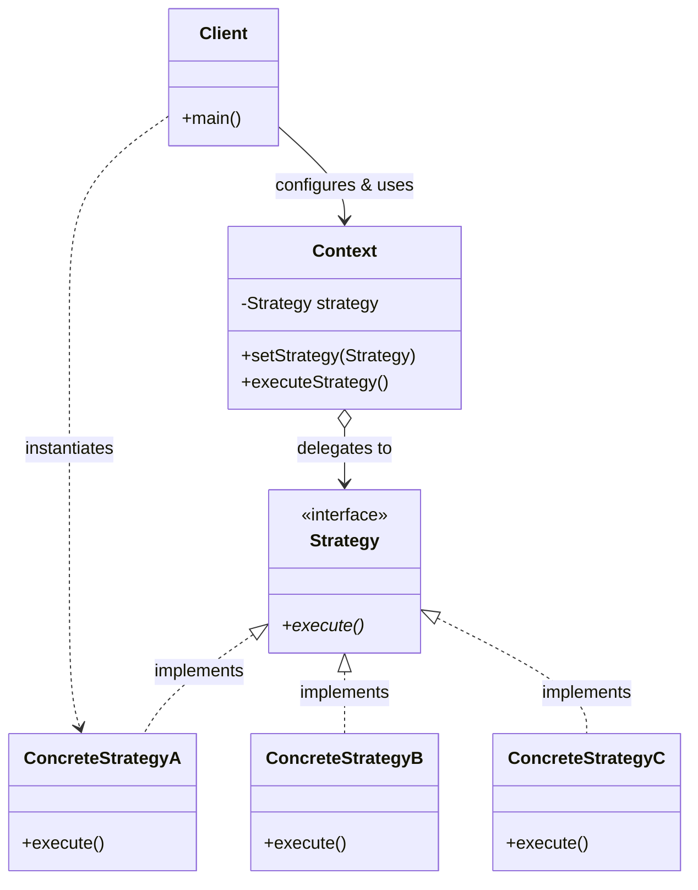
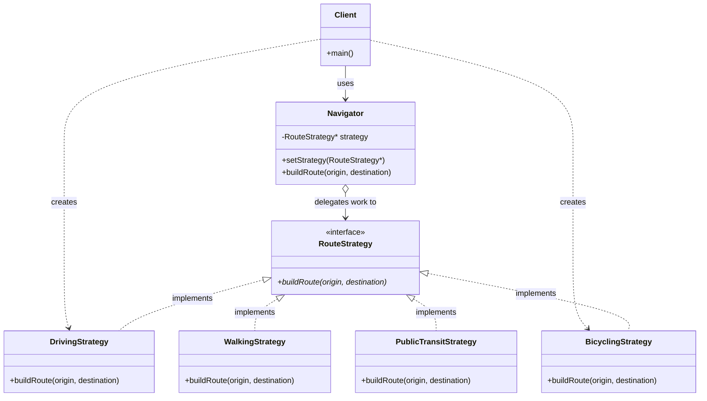

# Report: Strategy Design Pattern

## 1. Real-World Problem: Navigation App Route Planning

Imagine building a GPS navigation application like Google Maps. The application needs to calculate routes between an origin and a destination based on different transport modes:

- **Driving** — prioritizes highways, minimizes travel time, and accounts for live traffic and toll roads.
- **Walking** — prioritizes pedestrian pathways, sidewalks, footbridges, and park shortcuts while avoiding highways.
- **Public Transit** — calculates routes using bus timetables, metro schedules, and transfer connections.
- **Bicycling** — prioritizes dedicated bike lanes, flat elevation profiles, and cycling-friendly streets.

As the app grows, users expect new routing algorithms (e.g., Electric Scooter, Sightseeing Tour, Eco-Friendly Driving). 

In a naive system, calculating these different routes leads to conditional bloat, tight coupling, and extreme maintenance fragility whenever an algorithm is modified or added. The Strategy design pattern solves this coordination problem.

## 2. Naive Solution (Without the Pattern)

In a naive solution, a monolithic `Navigator` class uses an `enum` and a massive `if-else` or `switch` block to handle all routing logic directly in C++:

```cpp
// Navigator.h (Naive)
enum class TransportMode { DRIVING, WALKING, PUBLIC_TRANSIT };

class Navigator {
private:
    TransportMode mode;

public:
    Navigator(TransportMode m = TransportMode::DRIVING) : mode(m) {}

    void setMode(TransportMode m) { mode = m; }

    void buildRoute(const std::string& origin, const std::string& destination) {
        std::cout << "Calculating route from " << origin << " to " << destination << "...\n";
        
        if (mode == TransportMode::DRIVING) {
            std::cout << " -> Mode: DRIVING\n";
            std::cout << " -> Finding fastest highway route & avoiding toll booth queues.\n";
        } 
        else if (mode == TransportMode::WALKING) {
            std::cout << " -> Mode: WALKING\n";
            std::cout << " -> Finding pedestrian footpaths & park shortcuts.\n";
        } 
        else if (mode == TransportMode::PUBLIC_TRANSIT) {
            std::cout << " -> Mode: PUBLIC TRANSIT\n";
            std::cout << " -> Checking bus schedules & subway lines.\n";
        } 
        else {
            std::cout << " -> Error: Unknown transport mode!\n";
        }
    }
};

// main.cpp (Naive Client)
int main() {
    Navigator navigator(TransportMode::DRIVING);
    navigator.buildRoute("Home", "Office");

    navigator.setMode(TransportMode::WALKING);
    navigator.buildRoute("Office", "Park");

    return 0;
}
```

## 3. Problems with the Naive Solution

1. **Violation of the Open/Closed Principle (OCP)** — Every time a new transport mode (e.g., `BICYCLING`) is added or an existing algorithm is tuned, the core `Navigator` class must be edited and recompiled.
2. **Violation of the Single Responsibility Principle (SRP)** — `Navigator` is responsible for UI/Context management *and* the internal algorithmic mechanics of every single transport mode.
3. **Monolithic & Bloated Class** — As algorithms grow complex (including traffic APIs, timetable parses, elevation math), `Navigator.h` becomes thousands of lines long and impossible to maintain.
4. **Poor Testability** — Individual routing algorithms cannot be unit-tested in isolation without instantiating the entire `Navigator` context and setting enums.
5. **Runtime Inflexibility** — Algorithms cannot easily be swapped out dynamically or configured with custom strategy instances at runtime.

## 4. Introduction to the Strategy Pattern

**Strategy** is a behavioral design pattern defined by the Gang of Four (GoF) that defines a family of algorithms, encapsulates each one in a separate class, and makes their objects interchangeable. Strategy lets the algorithm vary independently from clients that use it.

**Intent**: Define a family of algorithms, encapsulate each one, and make them interchangeable. Strategy lets the algorithm vary independently from clients that use it.

**When to use**:
- You have many related classes that differ only in their behavior.
- You need different variants of an algorithm (e.g., fast vs. eco-friendly vs. pedestrian).
- An algorithm uses data that clients shouldn't know about.
- A class defines many behaviors that appear as multiple conditional statements (`switch`/`if-else`).

## 5. General Class Diagram



The **Client** creates a concrete `Strategy` object and passes it to the `Context`. The **Context** maintains a reference to a `Strategy` and delegates algorithm execution to it.

## 6. Class Diagram for the Navigation Problem



## 7. Implementation with the Strategy Pattern

### Strategy Interface & Concrete Implementations

```cpp
// RouteStrategy.h
class RouteStrategy {
public:
    virtual ~RouteStrategy() = default;
    virtual void buildRoute(const std::string& origin, const std::string& destination) const = 0;
};

// DrivingStrategy.h
class DrivingStrategy : public RouteStrategy {
public:
    void buildRoute(const std::string& origin, const std::string& destination) const override {
        std::cout << " -> Mode: DRIVING\n";
        std::cout << " -> Algorithm: Highway priority, real-time traffic bypass & toll roads.\n";
    }
};

// WalkingStrategy.h
class WalkingStrategy : public RouteStrategy {
public:
    void buildRoute(const std::string& origin, const std::string& destination) const override {
        std::cout << " -> Mode: WALKING\n";
        std::cout << " -> Algorithm: Pedestrian footpaths, crosswalk safety & park shortcuts.\n";
    }
};

// BicyclingStrategy.h (Added without modifying existing code!)
class BicyclingStrategy : public RouteStrategy {
public:
    void buildRoute(const std::string& origin, const std::string& destination) const override {
        std::cout << " -> Mode: BICYCLING\n";
        std::cout << " -> Algorithm: Dedicated bike lanes & elevation profile optimization.\n";
    }
};
```

### Context Implementation & Clean Client Code

```cpp
// Navigator.h (Context)
class Navigator {
private:
    const RouteStrategy* strategy;

public:
    Navigator(const RouteStrategy* initialStrategy = nullptr) : strategy(initialStrategy) {}

    void setStrategy(const RouteStrategy* newStrategy) { strategy = newStrategy; }

    void buildRoute(const std::string& origin, const std::string& destination) const {
        std::cout << "Calculating route from " << origin << " to " << destination << "...\n";
        if (strategy) {
            strategy->buildRoute(origin, destination);
        } else {
            std::cout << " -> Error: No strategy set!\n";
        }
    }
};

// main.cpp (Client)
int main() {
    DrivingStrategy driving;
    WalkingStrategy walking;
    BicyclingStrategy bicycling;

    Navigator navigator(&driving);
    navigator.buildRoute("Home", "Office");

    // Dynamic strategy switch at runtime
    navigator.setStrategy(&walking);
    navigator.buildRoute("Office", "Park");

    // Seamless extension
    navigator.setStrategy(&bicycling);
    navigator.buildRoute("Home", "River Trail");

    return 0;
}
```

## 8. Pros and Cons of the Strategy Pattern

### Pros
- **Open/Closed Principle (OCP)** — New strategies can be introduced without modifying the Context or existing strategies.
- **Single Responsibility Principle (SRP)** — Isolates algorithm implementation details from the context/UI logic.
- **Eliminates Conditional Statements** — Replaces complex `switch` or `if-else` trees with polymorphic delegation.
- **Runtime Algorithm Switching** — Allows switching strategies dynamically at runtime based on user preference or environmental state.
- **Isolated Unit Testing** — Each concrete strategy can be unit-tested completely independently.

### Cons
- **Increased Object Count** — Increases the number of classes/objects in the codebase.
- **Client Awareness Requirement** — Clients must understand how strategies differ in order to select and configure the right one.
- **Overhead for Simple Logic** — If an algorithm rarely changes or has only 1-2 trivial variations, Strategy introduces unnecessary indirection.

## 9. Other Real-World Applications

### Web Development (Authentication & Payment Gateways)
- **Passport.js / Auth0**: Uses strategy objects (`LocalStrategy`, `GoogleStrategy`, `OAuth2Strategy`) to authenticate users seamlessly.
- **Payment Gateways**: E-commerce platforms switch strategies (`CreditCardPayment`, `PayPalPayment`, `ApplePayPayment`) dynamically during checkout.

### Mobile Development (Layout Managers & Image Caching)
- **Android / iOS Layouts**: RecyclerView / UICollectionView uses layout strategies (`LinearLayoutManager`, `GridLayoutManager`, `StaggeredGridLayoutManager`) to render items.
- **Image Caching**: Glide / Kingfisher switches caching strategies (`MemoryCacheStrategy`, `DiskCacheStrategy`, `NetworkOnlyStrategy`).

### Game Development (AI & Physics Solvers)
- **NPC AI Behavior**: Non-player characters switch movement strategies (`PatrolStrategy`, `AttackStrategy`, `FleeStrategy`) based on threat level.
- **Physics Solvers**: Engines switch collision detection strategies (`BroadphaseSAP`, `BroadphaseGrid`) based on object density.

### Database Access & Sorting
- **Sorting Algorithms**: Standard libraries choose different sorting strategies (`QuickSort`, `HeapSort`, `InsertionSort` as in `std::sort` introsort) based on dataset size.

## 10. Quiz

1. **What type of design pattern is the Strategy pattern?**
   - a) Creational
   - b) Structural
   - c) Behavioral
   - d) Architectural

2. **What is the primary intent of the Strategy pattern?**
   - a) To adapt an incompatible interface to another
   - b) To define a family of algorithms, encapsulate each one, and make them interchangeable
   - c) To ensure a class has only one instance
   - d) To provide a unified interface to a set of interfaces in a subsystem

3. **Which SOLID principle is most directly promoted when adding a new Strategy subclass?**
   - a) Liskov Substitution Principle
   - b) Open/Closed Principle
   - c) Interface Segregation Principle
   - d) Dependency Inversion Principle

4. **In the Strategy pattern, what is the role of the Context?**
   - a) To instantiate all strategy classes automatically
   - b) To maintain a reference to a Strategy object and delegate algorithm execution to it
   - c) To convert incoming parameters into JSON format
   - d) To prevent the client from selecting strategies

5. **Which of the following is a potential disadvantage of the Strategy pattern?**
   - a) It tightly couples the context to concrete strategy implementations
   - b) Clients must be aware of different strategies to select the appropriate one
   - c) It prevents algorithms from being changed at runtime
   - d) It requires rewriting the Context every time a strategy is added

6. **How does Strategy differ from Template Method?**
   - a) Strategy uses object composition (delegation); Template Method uses inheritance
   - b) Strategy uses inheritance; Template Method uses composition
   - c) Strategy is a structural pattern; Template Method is creational
   - d) There is no difference between them

7. **In C++, why is it beneficial to pass concrete strategies by reference or pointer into the Context?**
   - a) It forces the compiler to inline all strategy methods
   - b) It prevents object slicing and avoids unnecessary object copying while supporting polymorphism
   - c) It turns the strategy into a Singleton automatically
   - d) It prevents the client from calling the strategy directly

### Answer Key
`1. c  2. b  3. b  4. b  5. b  6. a  7. b`

## 11. Group Presentation Notes

Each group presenting the Strategy design pattern will be reviewed by 2–3 other groups. Reviewers are responsible for:
- Listening carefully to the presentation.
- Asking questions for clarification.
- Challenging assumptions or design decisions.
- Facilitating discussion and deeper understanding of the pattern.

Reviewers should focus on: whether the real-world problem genuinely benefits from dynamic strategy swapping, whether the class diagrams accurately show composition (`Context o--> Strategy`), and whether the trade-offs (object explosion vs. OCP compliance) are objectively evaluated.

### References

- Gamma, E., Helm, R., Johnson, R., & Vlissides, J. (1994). *Design Patterns: Elements of Reusable Object-Oriented Software*. Addison-Wesley.
- Freeman, E., & Robson, E. (2004). *Head First Design Patterns*. O'Reilly Media.
- Refactoring Guru. (n.d.). *Strategy Design Pattern*. https://refactoring.guru/design-patterns/strategy
- SourceMaking. (n.d.). *Strategy Design Pattern*. https://sourcemaking.com/design_patterns/strategy
